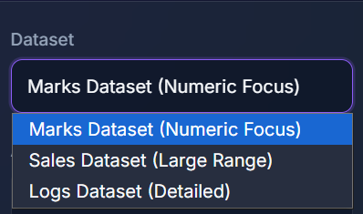
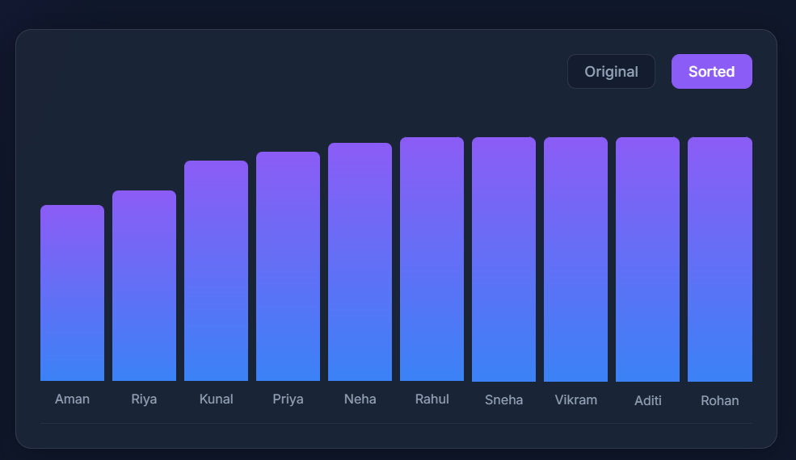

# 🚀 Smart Sorting Studio (C++)

> A clean and interactive C++ application that loads real datasets and compares multiple sorting algorithms using performance metrics like time, comparisons, and swaps.


---

## 📸 Screenshots

> Add your terminal screenshots here after running the project

* Screenshot 1: Dataset Selection 
* Screenshot 2: Sorted Output  
* Screenshot 3: Performance Report 

---

## ✨ Features

* 📂 Load real datasets from CSV files (Marks, Sales, Logs)
* 🔄 Supports multiple sorting algorithms:

  * Merge Sort
  * Quick Sort
  * Heap Sort
  * Counting Sort
  * Radix Sort
  * Bucket Sort
* ⚡ Fast C++ backend execution
* ⏱️ Measures execution time
* 🔢 Counts comparisons and swaps
* 📊 Displays sorted dataset clearly
* 📘 Shows stability and explanation of each algorithm
* 🧪 Easy testing with predefined datasets

---

## 🛠️ Tech Stack

* **Backend:** C++
* **Frontend:** HTML, CSS, JavaScript
* **Tools:** Node.js (for web handling)
* **Concepts Used:**

  * Data Structures & Algorithms
  * File Handling (CSV)
  * Time Measurement (`chrono`)
  * Modular Programming

---

## 📁 Project Structure

```
Smart-Sorting-Studio-CPP/
│
├── main.cpp
├── sorting_algorithms.h
├── sorting_algorithms.cpp
├── dataset_utils.h
├── dataset_utils.cpp
│
├── web/                # Frontend UI files
├── node_modules/       # Node dependencies (ignored in Git)
├── package.json
├── package-lock.json
│
├── run_web.bat         # Script to run web interface
├── sortingstudio.exe
├── README.md
└── .gitignore
```

---

## 🚀 Installation & Setup

### 1️⃣ Clone the repository

```bash
git clone https://github.com/your-username/smart-sorting-studio.git
cd smart-sorting-studio
```
### 2️⃣ Install Node dependencies (for web)
``` bash
npm install
```
### 3️⃣ Compile the project

```bash
g++ -std=c++17 main.cpp sorting_algorithms.cpp dataset_utils.cpp -o sortingstudio.exe
```

### 3️⃣ Run the application

```bash
./sortingstudio.exe
```
or

```bash
run_web.bat
---
```

## 📖 Usage

1. Run the program
2. Choose dataset:

   * Marks
   * Sales
   * Logs
3. Select sorting algorithm
4. View:

   * Sorted dataset
   * Execution time
   * Comparisons & swaps
   * Stability
   * Algorithm description

---

## 🧠 Algorithms / Logic

This project implements and compares:

* 🔹 **Merge Sort** → Stable, divide & conquer
* 🔹 **Quick Sort** → Fast average-case using pivot
* 🔹 **Heap Sort** → Memory efficient, heap-based
* 🔹 **Counting Sort** → Best for small integer ranges
* 🔹 **Radix Sort** → Digit-by-digit sorting
* 🔹 **Bucket Sort** → Works well for uniform data

Each algorithm tracks:

* Comparisons
* Swaps
* Execution time

---

## 🎯 Demo

**Dataset:** Marks
**Algorithm:** Merge Sort

**Sorted Output:**

```
Kunal - 65
Aman - 78
Neha - 81
Riya - 92
Priya - 92
```

**Performance:**

* Time Taken: 0.02 ms
* Comparisons: 8
* Swaps: 3
* Stable: Yes

---

## 🔮 Future Improvements

* 🌐 Convert into web-based UI (HTML/CSS/JS)
* 📊 Add charts for comparisongit branch -M main
git push -u origin main

## 👤 Author

**Jatin Kumar**
🎓 CSE Student | Chandigarh University

---

## 📄 License

This project is licensed under the **MIT License**.

---

⭐ If you like this project, consider giving it a star!
